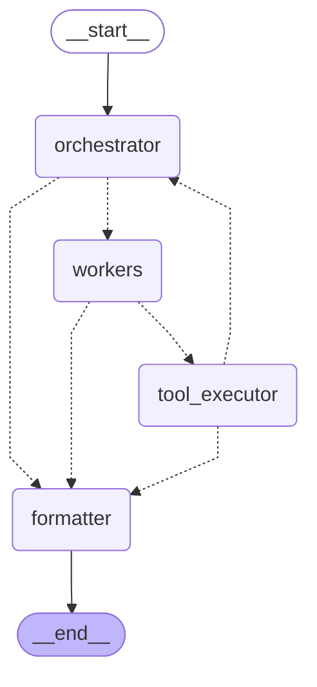

```mermaid
---
config:
  flowchart:
    curve: linear
---
graph TD;
	__start__([<p>__start__</p>]):::first
	orchestrator(orchestrator)
	workers(workers)
	tool_executor(tool_executor)
	formatter(formatter)
	__end__([<p>__end__</p>]):::last
	__start__ --> orchestrator;
	orchestrator -.-> formatter;
	orchestrator -.-> workers;
	tool_executor -.-> formatter;
	tool_executor -.-> orchestrator;
	workers -.-> formatter;
	workers -.-> tool_executor;
	formatter --> __end__;
	classDef default fill:#f2f0ff,line-height:1.2
	classDef first fill-opacity:0
	classDef last fill:#bfb6fc

```
