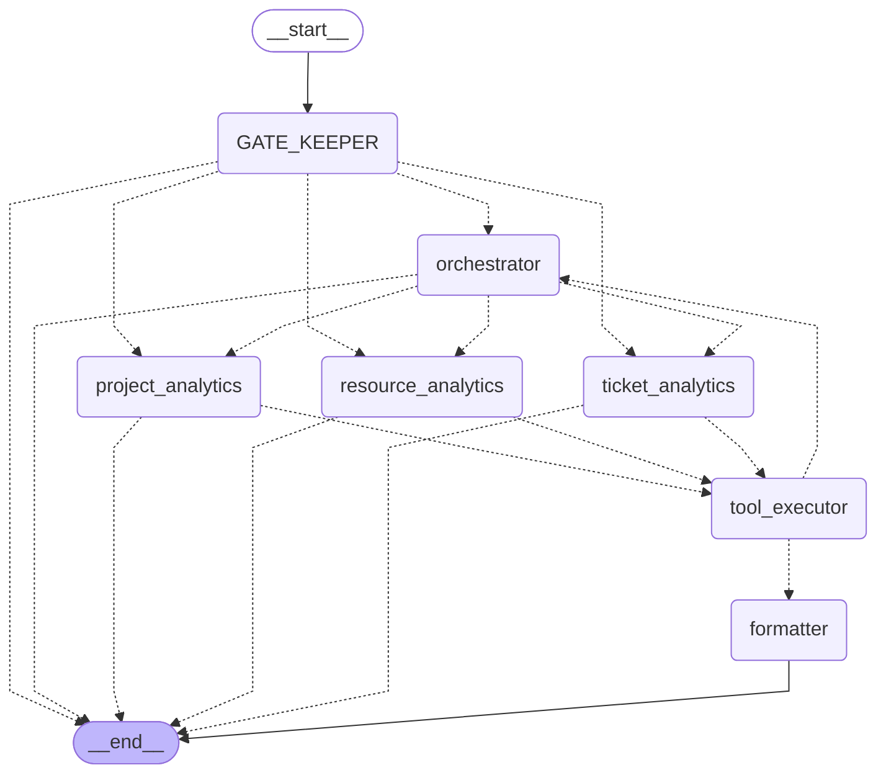

```mermaid
---
config:
  flowchart:
    curve: linear
---
graph TD;
	__start__([<p>__start__</p>]):::first
	GATE_KEEPER(GATE_KEEPER)
	orchestrator(orchestrator)
	project_analytics(project_analytics)
	ticket_analytics(ticket_analytics)
	resource_analytics(resource_analytics)
	tool_executor(tool_executor)
	formatter(formatter)
	__end__([<p>__end__</p>]):::last
	GATE_KEEPER -.-> __end__;
	GATE_KEEPER -.-> orchestrator;
	GATE_KEEPER -.-> project_analytics;
	GATE_KEEPER -.-> resource_analytics;
	GATE_KEEPER -.-> ticket_analytics;
	__start__ --> GATE_KEEPER;
	orchestrator -.-> __end__;
	orchestrator -.-> project_analytics;
	orchestrator -.-> resource_analytics;
	orchestrator -.-> ticket_analytics;
	project_analytics -.-> __end__;
	project_analytics -.-> tool_executor;
	resource_analytics -.-> __end__;
	resource_analytics -.-> tool_executor;
	ticket_analytics -.-> __end__;
	ticket_analytics -.-> tool_executor;
	tool_executor -.-> formatter;
	tool_executor -.-> orchestrator;
	formatter --> __end__;
	classDef default fill:#f2f0ff,line-height:1.2
	classDef first fill-opacity:0
	classDef last fill:#bfb6fc

```
